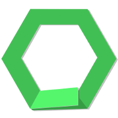

# OpenGML

<p align="center"></p>

[](https://github.com/maiple/opengml/actions)
[](./LICENSE)
[](https://discord.gg/3aztsGj)

**Download**: [Nightly](https://github.com/maiple/opengml/actions/workflows/build.yml). (Select a workflow, scroll down to artifacts. May require logging into Github to click the links. Better download link TBD.)

**What this is**: a free, open-source, cross-platform interpreter for GML 1.4 (with experimental support for GML 2.0), everyone's favourite game development language and toolkit. **It's easy**: `ogm ./MyGame.project.gmx` in any terminal and your game will launch.

**What this is not**: an IDE or graphical user interface. If you want to OpenGML for development, you must write your code, draw your sprites, and tile your rooms with your own preferred software. Recommendations are provided in the "[Other Software](#Other%20Software)" section below.

<p align="center"></p>

## Getting Started

- **Use**: To get started running an existing GML project or a new project, see the [Quickstart guide](./etc/QUICKSTART.md).
- **Debug**: Try `ogm --debug MyGame.project.gmx`
- **Build**: To compile OpenGML from source yourself, see the [build instructions](./etc/BUILD.md).
- **Link**: To use OpenGML as a C++ library for building your own tool, see the [Library guide](./etc/LIBRARY.md).
- **Develop**: If you are interested in helping to develop OpenGML, or you'd like to modify or hack it, or you just want to get an overview of the codebase, see both the [build instructions](./etc/BUILD.md) and the [Source Code Overview](./etc/SOURCE_OVERVIEW.md).
- **Recurse**: To use OpenGML from within GML (e.g. to replace `string_execute()`), see the usage instructions for [gig](./src/gig/README.md).

On Ubuntu, to compile from source using [Docker](https://www.docker.com/) and run the example (as mentioned in the [build instructions](./etc/BUILD.md), run the following bash code.

```
apt install docker
bash ./docker/build.sh ubuntu x86 # (x86 build is preferred for compatability with 32-bit DLLs on some projects.)
./out-ubuntu-x86/ogm demo/projects/example/example.project.gmx
```

## Features

- Written to be totally compatible with the 1.4 version of everyone's favourite game creation toolkit, unlike [ENIGMA](https://enigma-dev.org/), which does not (and will never be able to) run all games written in GML. (100% compatability for OpenGML **isn't yet achieved**, but it is a design goal from the ground-up.)
- Uses **OpenGL** in an **SDL2** context for graphics.
- Available as a **stand-alone binary** to interpret GML: `ogm ./MyGame.project.gmx`
- Can also be used as a **C++ library** to parse, compile, and execute GML code: `#include <ogm/ast/parse.h>`
- Comes with a **debugger**. Place conditional breakpoints and watchpoints, view and edit variables in place, and step through source code or bytecode instructions if you prefer. Available from the command-line with `ogm --debug MyGame.project.gmx`.
- Compiles to an intermediate [bytecode format](./include/ogm/bytecode/bytecode.hpp), allowing speedy execution and the future potential for compilation to different targets (e.g. JavaScript/HTML5).
- On UNIX systems, [zugbruecke](https://github.com/pleiszenburg/zugbruecke) can optionally be used to run **windows DLLs** and extensions via wine. (This maximizes support for running existing games on Linux or Mac.)

## Planned Features

- Beautifier
- 100% compatability with GML.
- GML 2.0 support

## Other Software

Here are some software suggestions which may be helpful for creating games with OpenGML. Not all of these have been tested for interoperability.

### Code Editors

- [GMEdit](https://yellowafterlife.itch.io/gmedit) (also on [github](https://github.com/GameMakerDiscord/GMEdit)), a code editor for GML with extended syntax. **Recommended.**
- A text editor like [Notepad++](https://notepad-plus-plus.org/), [Notepadqq](https://notepadqq.com/s/), or [Atom](https://atom.io/).

### Room Editors

- [PushEd](https://github.com/GameMakerDiscord/PushEd), which creates GML-compatible rooms in both 2D and 3D.

### Image Editors

- [GIMP](https://www.gimp.org/), a powerful open source, cross-platform image editing tool.
- [Krita](https://krita.org/en/), a powerful open source, cross-platform digital painting tool.

### Other compilers and interpreters

If you decide you don't like OpenGML, you may be interested in these alternatives. Not all of them are complete or usable.

- [ENIGMA](https://enigma-dev.org/) is popular compiler, though it [isn't 100% accurate](https://enigma-dev.org/docs/Wiki/GM_Incompatibilities) to GML and probably won't work for large existing codebases.
- [Game Creator](https://github.com/joshwyant/game-creator), which compiles to Microsoft's .NET framework.
- [Acolyte](https://github.com/donkeybonks/acolyte), which compiles to C++.
- [DejaVu](https://github.com/rpjohnst/dejavu-llvm), an llvm-based compiler.
- [DejaVu](https://github.com/rpjohnst/dejavu) (Rust), a rust reimplementation of the above.
- [GM8Emulator](https://github.com/Adamcake/Legacy-GM8Emulator) (C++), which runs GM8 projects.
- [GM8Emulator](https://github.com/OpenGM8/GM8Emulator) (Rust), a rust reimplementation of the above.
- [Runero](https://github.com/bobtheblueberry/Runero), a runner written in Java.

### Full-Resource IDEs

These combine all of the above to offer all of the different tools needed to create a game in GML in one comprehensive user-interface.

- The best and most reliable IDE and compiler available for this programming language can be found [here](https://www.yoyogames.com/). Neither free nor open source.
- [LateralGM](http://lateralgm.org/), an open source IDE for GML and ENIGMA. Might be out of date.
